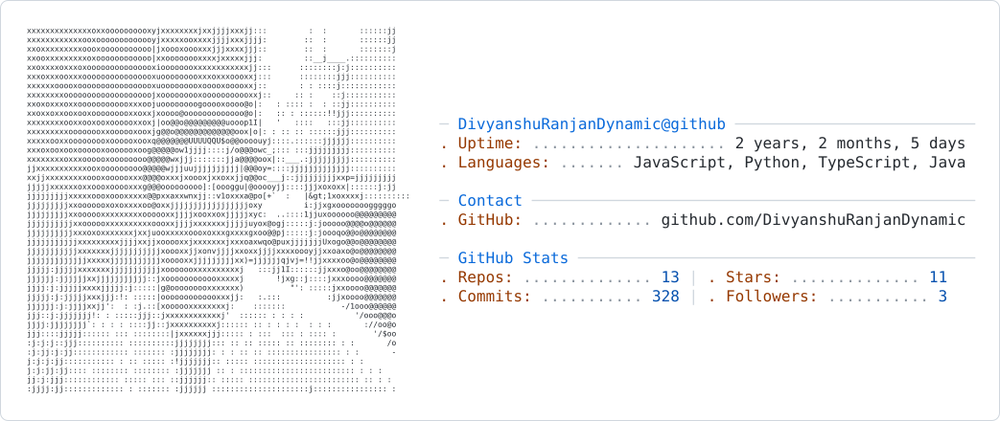

## Hi there 👋 I'm Divyanshu Ranjan

<picture>
  <source media="(prefers-color-scheme: dark)" srcset="./dark_mode.svg">
  <source media="(prefers-color-scheme: light)" srcset="./light_mode.svg">
  
</picture>

### 🚀 About Me

* 💻 Computer Science Engineering student
* 🔥 Passionate about **Backend Development, System Design & AI**
* 🧠 Solving **Data Structures & Algorithms** problems
* ⚙️ Building scalable applications with **Java, Node.js, Django & Next.js**
* 🤖 Exploring **AI/ML, LLMs and AI-powered applications**
* 🚀 Building products and working on startup ideas
* 📚 Always learning and improving

### 🛠️ Tech Stack

**Languages:**
Java · JavaScript · TypeScript · Python

**Backend:**
Spring Boot · Node.js · Express.js · Django · FastAPI

**Frontend:**
React · Next.js · HTML · CSS · Tailwind CSS

**Databases & Infrastructure:**
MongoDB · PostgreSQL · Redis · AWS · Docker

**AI/ML:**
PyTorch · Transformers · WhisperX · LLM APIs

### 📊 GitHub Stats

  
  

### 🤝 Let's Connect

  
  

