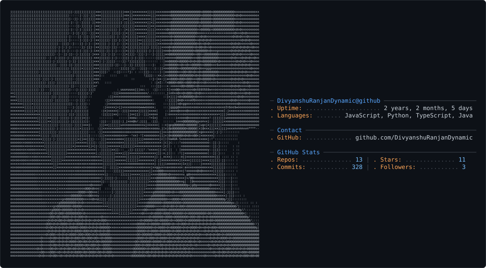

## Hi there 👋 I'm Divyanshu Ranjan

<picture>
  <source media="(prefers-color-scheme: dark)" srcset="./dark_mode.svg">
  <source media="(prefers-color-scheme: light)" srcset="./light_mode.svg">
  
</picture>

### 🛠️ Tech Stack

**Languages:**
Java · JavaScript · TypeScript · Python

**Backend:**
 Node.js · Express.js · Django · FastAPI

**Frontend:**
React · Next.js · HTML · CSS · Tailwind CSS

**Databases & Infrastructure:**
MongoDB · PostgreSQL · Redis · AWS · Docker

**AI/ML:**
PyTorch · Transformers · WhisperX · LLM APIs

